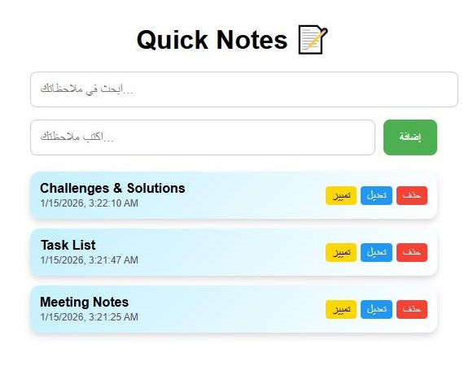
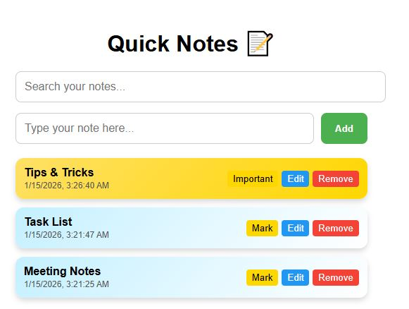

# Quick Notes App 📝

## Description
Quick Notes is a full-stack web application built with React and Firebase.  
It allows users to register, login, and manage their personal notes securely in the cloud.  
Each user has their own set of notes, which can be added, edited, deleted, and marked as important.

---

## Features
- User Authentication (Register/Login/Logout) via Firebase  
- Save notes per user in Firestore Database  
- Add, edit, delete notes  
- Mark notes as important  
- Search notes in real-time  
- Responsive and clean UI

---

## Future Improvements
- Dark Mode 
- Undo after deletion 
- Tags / Categories 
- Toast Notifications 
- Tests, ESLint, CI/CD  
- PWA support (Offline + Installable)

## Screenshots

### Notes

### Marking Note

## Firebase Setup
To get the backend working, follow these steps:

- Create a project at the Firebase Console.
- Authentication: Enable Email/Password provider.
- Firestore Database: Create a database (start in Test Mode for development).
- Config: Copy your Firebase SDK configuration.
- Integration: Paste the config into your src/firebase.js file.

## Technologies Used
- Frontend: React.js, HTML5, CSS3, JavaScript (ES6+)
- Build Tool: Vite
- Backend: Firebase (Firestore & Authentication)

---

## Getting Started

Follow these instructions to set up the project locally on your machine.

## Prerequisites
* Make sure you have [Node.js](https://nodejs.org/) installed on your system.
* A Firebase account to set up the backend.

## Installation & Run

bash
## Clone the repository
git clone https://github.com/rabeasaad/quick-notes-react.git

## Navigate to the project folder
cd quick-notes-react
---
## Install dependencies
npm install
---
## Start the development server
npm run dev
run dev
---
## Author
Rabea Alsoudi 
GitHub: @rabeasaad

## License
This project is open-source and available under the MIT License.